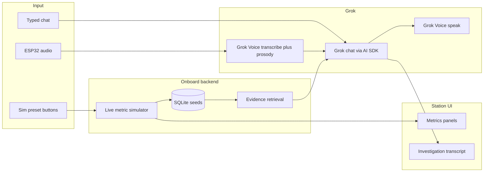

# Iris hackathon implementation plan

## Context and constraints

- **Product name:** **Iris** — onboard autonomous health investigation assistant for deep-space crews (repo: `iris`).
- **Repo state:** [ui/src/app/page.tsx](ui/src/app/page.tsx) is the only app code at `HEAD`; prior station/API/lib code was purged. Treat this as a **greenfield rebuild** inside [ui/](ui/) (Next 16, React 19, Tailwind 4, shadcn config in [ui/components.json](ui/components.json), `better-sqlite3` already in [ui/package.json](ui/package.json)). Update home copy from legacy “MED-1” to **Iris**.
- **Hackathon eligibility:** Built with Cursor; must use **Grok** via **Vercel AI SDK** for text generation and **Grok Voice** for audio in/out (ESP32 posts audio; app transcribes + analyzes delivery).
- **Product stance:** No diagnoses or “X caused Y” assertions. **Iris** runs an **investigation loop**: observe → compare to **personal baseline** → identify missing evidence → collect (metrics, env, history, literature) → reevaluate. Output is in-depth: hazards, **correlational/causal hypotheses with justification**, trend language (e.g. vitals vs rising CO₂), and **citations** that plausibly reference onboard OSDR/history (retrieval is seeded/local; LLM narrates support/contradiction for demo).
- **NASA reference** (inject in system prompt): [Human Research Roadmap – Risk 95](https://humanresearchroadmap.nasa.gov/Risks/risk.aspx?i=95).
- **Demo:** Two simulation buttons only; judges click a preset, then speak; UI shows metrics + streamed investigation text; Iris **speaks** the high-signal parts (reassurance, urgent actions).

---

## Architecture (layers)

| Layer             | Responsibility                                                                                                                                                                                                                                                                                                                                                                     |
| ----------------- | ---------------------------------------------------------------------------------------------------------------------------------------------------------------------------------------------------------------------------------------------------------------------------------------------------------------------------------------------------------------------------------- |
| **Data**          | SQLite: crew A01 (player), A02/A03 peer logs; personal baselines; time-series vitals, intake, strength; cabin telemetry (O₂, CO₂, water purity); external (radiation, solar flare flag); OSDR/historical **evidence documents** with stable citation IDs.                                                                                                                          |
| **Simulation**    | Server-side “mission clock” + presets **Mild** / **Dire** that set initial deltas and tick behavior (Mild: near-baseline vitals + calm env; Dire: low BP, nausea pattern, elevated radiation, peer log matches).                                                                                                                                                                   |
| **Investigation** | `POST /api/investigations` (create) + `POST /api/investigations/[id]/actions` (user message or voice-derived payload) + optional `GET` for state. Build a **context bundle** each turn: current vitals vs baseline, short trends, env snapshot, active sim preset, voice metadata (stress, breathlessness, weakness), retrieved evidence chunks. Stream Grok response with AI SDK. |
| **Voice**         | `POST /api/voice` (multipart audio from ESP32 or browser): Grok Voice → transcript + structured **voice assessment** (affect, respiratory effort, panic cues—not diagnosis). Return transcript to investigation route. **TTS path:** `POST /api/voice/speak` or same route with `mode=speak` for consoling/urgent lines.                                                           |
| **UI**            | `/station` dashboard: header **Iris**, left **crew vitals**, right **cabin + space**, bottom strip **peer crew**, center **chat** (default voice-first UX copy), right-bottom **sim taskbar (2 buttons)**, main **investigation panel** (markdown-ish text, citation chips, severity badges). Home `/` links to `/station`—restore missing route and shadcn primitives.            |

---

## Grok prompts (high level)

**System prompt (investigation):**

- Role: **Iris**, onboard medical investigation assistant for long-duration spaceflight.
- Rules: no definitive diagnosis; use “consistent with / warrants monitoring / consider collecting”; always compare to **this astronaut’s baseline**; cite onboard evidence by `[EVID-xxx]` or dataset labels; mention NASA HRR risk framing when relevant.
- Loop instructions: state what was observed, what’s missing, propose next measurement or question, synthesize env + health **trends**, compare to **historical OSDR and peer crew logs** (narrative grounded in retrieved snippets).
- Include link to NASA risk page above.

**Voice analysis prompt (post-transcription):**

- Extract symptoms from text; separately score **paralinguistics** from audio (if API returns them) or from instructed multimodal fields: panic, breathlessness, weak/feeble voice, cognitive strain—fed as structured JSON into investigation context.

**Scenario hints (in preset metadata, not user-visible):**

- **Mild:** transcript may say dizzy, headache, shortness of breath, slight distress; context vitals ~normal; env nominal; Iris should calm and suggest benign differentials + optional recheck.
- **Dire:** nausea, vomiting, light flashes, low BP, rising radiation, fear; peer logs show similar episodes; investigation escalates monitoring, env correlation, radiation exposure discussion with citations, clear “actions to consider” without claiming certainty.

---

## Key files to add (suggested layout)

Restore the shape that existed pre-purge (good fit for this spec):

- **App:** `ui/src/app/layout.tsx`, `ui/src/app/station/page.tsx`, `ui/src/app/station/layout.tsx`, `ui/src/styles/globals.css`
- **API:** `ui/src/app/api/mission/route.ts`, `crew/[id]/route.ts`, `environment/route.ts`, `monitoring/tick/route.ts`, `investigations/route.ts`, `investigations/[id]/route.ts`, `investigations/[id]/actions/route.ts`, `voice/route.ts` (new)
- **Lib:** `ui/src/lib/db/{schema.sql,client.ts,seed.ts,queries.ts,types.ts}`, `ui/src/lib/telemetry/{live.ts,signals.ts}`, `ui/src/lib/baseline/{compare.ts,trends.ts,labels.ts}`, `ui/src/lib/evidence/retrieve.ts`, `ui/src/lib/investigation/{service.ts,types.ts,constants.ts}`, `ui/src/lib/station/view-model.ts`
- **Data:** `ui/src/data/*.json` (OSDR-inspired + cabin telemetry samples), `ui/src/data/CITATIONS.md`
- **Components:** `ui/src/components/station/*` (header with Iris branding, vitals, environment, peers, investigation panel, monitoring provider, sim taskbar), `ui/src/components/ui/*` (shadcn: button, card, badge, input, alert, skeleton, separator, select)
- **Config:** [ui/.env.example](ui/.env.example) with `XAI_API_KEY`, optional `DATABASE_PATH`; document ESP32 `VOICE_INGEST_URL`

**Dependencies to add:** `ai`, `@ai-sdk/xai`, and any Grok Voice HTTP client types you need (wrap raw `fetch` if no official SDK helper).

---

## ESP32 contract (minimal for demo)

- **POST** `https://<host>/api/voice` with `crewId=A01`, `audio` file (wav/pcm), optional `investigationId`.
- Response: `{ transcript, voiceAssessment, investigationId? }`.
- Optional: poll or SSE investigation updates; for hackathon, **browser station** can also record/upload the same endpoint when ESP32 is unavailable.

---

## Demo script (judges)

1. Open `/station` — Iris online, metrics ticking, A01 selected.
2. Click **Mild** sim → speak scripted symptoms → Iris streams investigation, cites mild evidence, speaks reassurance.
3. Reset or new investigation → click **Dire** sim → speak dire script → UI shows radiation/peer correlation, stronger hazards, spoken urgency on key actions.
4. Optionally show typed fallback in the same thread.

---

## Testing and quality (timeboxed)

- Vitest: baseline compare, trend labels, evidence retrieval ranking, investigation context builder (no live Grok in CI).
- Manual: `pnpm dev`, both sim presets, one voice upload, streaming chat visible.

---

## Out of scope (unless time remains)

- Real OSDR API calls, real biometrics hardware, full multi-turn voice on device without ESP32, production auth.
