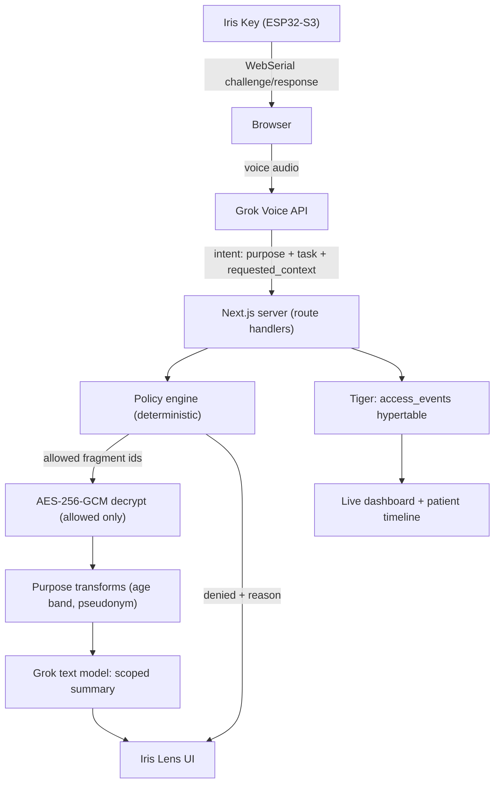

# Iris: Hardware + Software Integration Plan

## The one thing we protect

Every decision below defers to the final flow in [idea.md](idea.md) section 30: plug in Iris Key, authenticate, ask by voice, Grok extracts purpose, policy engine selects fragments, only those decrypt, Grok answers, Tiger logs, purpose changes, view changes, break-glass with physical confirmation, dashboard updates, patient sees it. If something in this plan threatens that flow, cut the something.

## Prize coverage map

- **Best Healthcare Hack (primary)**: purpose-bound clinical lenses, unblockable break-glass, plain-English patient access page.
- **SpaceXAI "Make it Legendary"**: Grok Voice API is the actual clinical input path (context requests, break-glass reason capture, action commands) — not transcription decoration. Built entirely in Cursor; push to **Cursor Origin** as a second remote alongside GitHub (`skills-cursor/new-repo`) and keep a `docs/CURSOR.md` log of agent-driven work. Two physical boards + LED/TFT make it the loudest table in the room.
- **Auctor "Conversation to Action"**: `createClinicalHandoff` and `createEngineeringDelegation` are real state-changing tools — they write rows, produce artifacts, and emit audit events.
- **Best Use of Tiger Data**: `access_events` hypertable, continuous aggregates powering the live dashboard, hash-chained tamper-evident audit, time-bucketed anomaly query.

## Architecture



Hard rule enforced in code: `decryptFragment()` is only callable from inside `policy.evaluate()`'s allowed set, and the Grok client refuses payloads containing fragment ids not in the current decision. Put that assertion in the code so we can show it to a security judge.

## Stack decisions (locked, to avoid mid-hack debate)

- Next.js 16 App Router (existing `ui/`), Tailwind v4, shadcn/ui, route handlers + server actions. No tRPC — not worth the setup hour.
- `postgres.js` with plain `.sql` migration files in `ui/src/server/db/migrations/`. Hypertables and continuous aggregates are far easier in raw SQL than through an ORM.
- Tiger Cloud free service. One `DATABASE_URL`, plus `IRIS_MASTER_KEY` (32-byte base64) in env — document that production would use a KMS/HSM outside the DB.
- Grok: `grok-4` text for intent extraction and summarization; **Grok Voice API** for the voice turns. Browser Web Speech API is the automatic fallback behind one feature flag (`NEXT_PUBLIC_VOICE_MODE`) so a dead API key at 3am can't kill the demo.

## Data model (Tiger)

Regular tables: `users`, `devices`, `patients`, `encounters`, `patient_relationships`, `policies`, `record_fragments`, `delegations`, `sessions`, `generated_actions`.

`record_fragments` is the heart — one row per fact:

```sql
create table record_fragments (
  id uuid primary key default gen_random_uuid(),
  patient_id text not null,
  encounter_id text,
  fragment_type text not null,        -- allergy, medication, psychiatric_note, phone...
  sensitivity text not null,          -- identifier | clinical | highly_sensitive | financial
  purpose_classes text[] not null,
  ciphertext bytea not null, iv bytea not null, auth_tag bytea not null,
  created_at timestamptz default now()
);
```

AAD binds ciphertext to `patient_id|fragment_type` so fragments can't be swapped between patients.

`access_events` hypertable, chunked 1 hour, with `previous_event_hash`/`event_hash` chain, plus a continuous aggregate `access_events_5min` over `(purpose, decision, break_glass)` for the dashboard, and a real-time view for the live stream.

## Policy engine

Pure function, zero AI: `evaluate({ role, relationship, purpose, task, patientId, breakGlass, delegation }) -> { allow: FragmentType[], transform: Record<FragmentType, Transform>, deny: Array<{type, reason}> }`.

Seeded `policies` rows cover the six demo purposes: `treatment`, `medication_prescription`, `scheduling`, `research`, `engineering_debug`, `emergency_treatment`. Every denial carries a human reason string ("Outside current chest-pain treatment context") because the UI must show _why_ a card is locked. `research` returns mostly transforms rather than denials — that's what makes Scene 2 land.

## Hardware (2x ESP32-S3)

- **Board A = `IRIS-0042`** (Dr. Maya Chen). **Board B = `IRIS-ENGINEER-07`** (Alex Kim). Same firmware, identity from a per-board `DEVICE_ID` + provisioned HMAC secret in NVS.
- Newline-delimited JSON over USB CDC at 115200: `HELLO` → `{deviceId}`, `CHALLENGE <nonce>` → `HMAC-SHA256(secret, nonce)`, `PRESENCE <nonce>` every 3s, `CONFIRM <nonce>` → waits for the BOOT button (GPIO0) and returns a signed confirmation or times out at 20s.
- **WS2812 8-LED strip** mirrors session state in the exact UI colors: idle white, green authenticated, amber purpose-limited, red denied, pulsing purple during emergency access. This is the single highest-value-per-minute hardware feature — do it right after the button works.
- **TFT SPI screen** (P2, one board only): identity line + "PRESS TO CONFIRM EMERGENCY ACCESS". Skip without guilt if time is tight.
- Nonces come from the server, never the browser. Server holds the secret and verifies; the browser is only a serial pipe.
- Presence: server marks a session dead if `last_presence_at` is older than 8s. On death → wipe client state, close the voice channel, log `DEVICE_REMOVED` + `SESSION_END`.
- NFC/sound/other sensors stay in the bag. They'd dilute the story, and `idea.md` explicitly rules out NFC as the primary interaction.

## Grok tool surface

Narrow, server-side, each one emitting an access event: `requestPatientContext`, `createClinicalHandoff`, `createEngineeringDelegation`, `requestBreakGlass`, `submitBreakGlassReason`, `showAccessHistory`, `explainAccessDecision`, `updatePatientRecord`. Grok chooses which to call and phrases the result; the policy engine decides what data exists to phrase.

## Pages

`/` hardware login, `/provider` Iris Lens (patient cards with allow/limit/lock states, purpose chip, voice button, break-glass), `/engineer` scoped delegation view, `/patient` plain-English timeline, `/security` live Tiger dashboard. Shared `<FragmentCard>` with four visual states is the component that sells the whole thesis.

## 24-hour sequencing, 4 parallel tracks

Two integration checkpoints where everyone stops and wires together: **T+9h** (auth → lens → event logged, mock voice) and **T+17h** (full demo rehearsal, no new features after this except polish).

- **Track A — Data & policy (hours 0-9)**: Tiger service, migrations, crypto module, seed Maya Patel P1048 with ~18 fragments across all sensitivity classes, policy engine + unit tests for the treatment-vs-research divergence, event writer with hash chain.
- **Track B — Frontend (hours 0-12)**: shadcn install, `FragmentCard` states, provider lens, patient timeline, security dashboard shell. Works against a mock policy response until A lands.
- **Track C — Grok & actions (hours 3-15)**: intent extraction prompt + schema, Grok Voice session with ephemeral server-minted tokens, tool dispatch layer, handoff generation, break-glass reason capture.
- **Track D — Firmware & WebSerial (hours 0-10)**: firmware sketch, WebSerial client hook, challenge verification endpoint, heartbeat + session kill, LED states, second board provisioned as engineer key.
- **Hours 17-22 (all)**: demo rehearsal on the actual demo laptop and Wi-Fi, break-glass timing, dashboard live-update feel, README with the honest-claims language from section 27.
- **Hours 22-24**: freeze. Nothing merges but copy fixes.

## Fallbacks decided in advance

- Grok Voice fails → `NEXT_PUBLIC_VOICE_MODE=webspeech`, same intent pipeline.
- Board fails → `?simulate=IRIS-0042` dev route mimics the serial protocol; keep one board as spare rather than wiring the TFT.
- Tiger Cloud unreachable → local Postgres + TimescaleDB in Docker, same migrations.
- Dashboard needs volume → seed 4,800 backdated synthetic events so the "today" counters look real and our live actions visibly move them.

## Claims discipline

README and script say "hardware-backed credential", "purpose-aware governance layer", "tamper-evident audit trail", "production would require BAA/HIPAA infrastructure", "synthetic data". Never "immutable", never "HIPAA compliant", never "the AI decides access". Section 27 of [idea.md](idea.md) is the wording source of truth.
