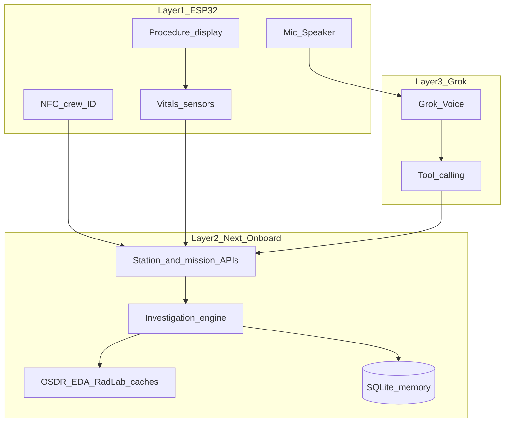

# MED-1 step-by-step implementation plan

**Source of truth for product intent:** [idea.md](idea.md) — three layers (ESP32 station → mission health system → Grok investigation). Cursor + Grok + real NASA space data are track requirements, not decoration.

## Stack and architecture (locked for hackathon)

| Layer                           | Choice                                                                                                                                             |
| ------------------------------- | -------------------------------------------------------------------------------------------------------------------------------------------------- |
| Layer 1 — Physical station      | **ESP32** under [firmware/](firmware/): NFC crew ID, vitals sensors (or mock), display prompts, **mic/speaker** audio path into Grok Voice / MED-1 |
| Layer 2 — Mission health system | Next.js App Router in [ui/](ui/) + in-memory SQLite (`better-sqlite3`)                                                                             |
| Layer 3 — Investigation AI      | **Grok Voice + Grok API tool calling** (orchestrates; engine + DB remain source of truth)                                                          |
| NASA / space evidence           | **Curated real-source caches** with explicit citations (OSDR / EDA / RadLab)—see Step 5; optional live RadLab fetch if time                        |



**Product guardrails baked into code from step 3 onward:** every user-facing string and LLM system prompt enforces _investigation not diagnosis_; evidence items carry `kind`: `observation` | `personal_deviation` | `correlation` | `historical_context`.

---

## Step 1 — Mission shell + in-memory data plane (done)

**Build**

- Add DB bootstrap: `ui/src/lib/db/schema.sql`, `ui/src/lib/db/client.ts`, `ui/src/lib/db/seed.ts`.
- Tables (minimal): `crew`, `baseline_metrics`, `measurements`, `environment_readings`, `historical_evidence`, `mission_state`.
- Seed **Mars transit, day ~180**, 4 crew (`A01`–`A04`), A02 baseline HR ~62, mission env with **one latent anomaly** (e.g. elevated cabin CO2 or O2 fraction drift) not obvious until queried.
- Route Handlers: `GET /api/mission`, `GET /api/crew/[id]`, `GET /api/environment`.
- Replace boilerplate [ui/src/app/page.tsx](ui/src/app/page.tsx) with a link into `/station` (or redirect).

**You can test**

- `pnpm dev` → open `/api/crew/A02` → JSON shows personal baselines vs population reference.
- `/api/mission` shows crew roster, simulated **Earth comm delay** (e.g. 12–22 min one-way), mission day.

**Visible difference:** the app is no longer a T3 placeholder; it exposes real mission data from “onboard storage.”

---

## Step 2 — Medical station UI (sleek shadcn dashboard)

**Goal:** A **simple, proper** medical station screen—readable in 10 seconds, no feature creep. Tailwind for layout; **shadcn/ui** for polished primitives. This step is **context + identity + vitals + environment only**; the investigation loop stays in Step 3.

**Design principles**

- **One screen, three jobs:** (1) where we are in the mission, (2) who is at the station, (3) what we know about their health and the cabin right now.
- **Sleek, not busy:** dark theme, generous whitespace, semantic tokens (`bg-background`, `text-muted-foreground`)—no neon “sci-fi” chrome, no charts, no fake telemetry wallpaper.
- **Core product unchanged:** we are not building a health analytics dashboard; we are building the **frame** that Step 3’s investigation UI will slot into (center column reserved for conversation/actions later).

**Setup (first tasks in this step)**

- Run shadcn init in `ui/` if `components.json` is missing (`pnpm dlx shadcn@latest init`) — default style, **dark** class on `html` or `layout` for station routes.
- Add only the components needed (keep the tree small):
    - `card`, `badge`, `select`, `separator`, `skeleton` (loading)
    - Optional: `alert` for a single non-diagnostic disclaimer line (“Investigation support — not a diagnosis”)

**Layout** — `ui/src/app/station/page.tsx` (+ `ui/src/app/station/layout.tsx` if useful for dark shell)

| Zone                  | Content                                                                                                                                          | shadcn building blocks                                     |
| --------------------- | ------------------------------------------------------------------------------------------------------------------------------------------------ | ---------------------------------------------------------- |
| **Top bar**           | MED-1 title, mission name, **Mission day 180**, **Earth comm ~18 min** one-way, link status `connected` (read-only for now)                      | `Card` or plain header + `Badge` variants                  |
| **Crew**              | **Select** crew A01–A04 (default A02 for demo); show name + role                                                                                 | `Select` + `Card`                                          |
| **Vitals**            | For selected crew: last known HR / SpO2 / temp + **personal baseline** (mean or min–max) vs **population range**—short labels, no diagnosis copy | 2–3 `Card`s in a responsive grid                           |
| **Cabin environment** | Compact list from `/api/environment`: metric, value, unit, `Badge` **nominal** vs **above/below nominal** (CO₂ should show as non-nominal)       | `Card` + `Badge`; one line disclaimer that anomaly ≠ cause |

**Data wiring**

- Server Components preferred: fetch `GET /api/mission`, `/api/crew/[id]`, `/api/environment` via shared `lib` helpers (or direct `queries` on server—avoid duplicating logic).
- Client only where needed: crew `Select` updates URL (`/station?crew=A02`) or local state; page refetches crew payload for that id.
- Loading: `Skeleton` placeholders; errors: single `Alert`, not custom divs.

**Components** (thin wrappers, no business logic)

- `ui/src/components/station/station-header.tsx`
- `ui/src/components/station/crew-selector.tsx`
- `ui/src/components/station/vitals-summary.tsx`
- `ui/src/components/station/environment-strip.tsx`
- Reuse `ui/src/components/ui/*` from shadcn; follow [shadcn skill](C:\Users\nanna.agents\skills\shadcn\SKILL.md) (semantic colors, `Card` composition, `Badge` for status).

**Explicitly out of scope for Step 2** (defer to later steps)

- Investigation transcript, symptom entry, action buttons → Step 3
- Baseline deviation engine UI copy beyond showing numbers → Step 4
- Historical evidence board, space weather, crew escalation banner → Steps 5–6
- Grok Voice, autonomous toggle, handoff export → Steps 7–8
- Extra pages, settings, crew roster tables, charts/sparklines, animations, `POST /api/demo/reset` unless you hit a demo blocker

**Optional (only if zero cost)**

- `POST /api/demo/reset` to re-seed in-memory DB between judge runs.

**You can test**

1. `pnpm dev` → **http://localhost:3000/station**
2. Mission bar shows day **180**, comm delay **18** min, four crew in selector.
3. Select **A02** → vitals cards show HR baseline **~62** and population band **60–100**; latest measurements from seed visible.
4. Environment card lists readings; **CO₂** shows non-nominal badge; copy does not say CO₂ “caused” anything.
5. Resize to mobile width: grid stacks; nothing critical hidden.
6. Home → “Open medical station” still works; APIs unchanged if called directly.

**Visible difference:** judges see a **clean MED-1 station** with real onboard data—not raw JSON, not a placeholder—and the UI clearly leaves room for the investigation loop as the hero in Step 3.

---

## Step 3 — Investigation engine v1 (deterministic loop) (done)

**Build**

- Core types + state machine in `ui/src/lib/investigation/`:
    - `Investigation` with `scope: individual | crew`, `status`, `evidence[]`, `open_questions[]`, `completed_actions[]`.
    - Loop implementation: **observe → compare → missing evidence → collect → reevaluate** driven by rules, not Grok.
- Tables: `investigations`, `investigation_evidence`, `investigation_events`.
- APIs:
    - `POST /api/investigations` — body: `{ crewId, reportedSymptoms: string[] }`
    - `POST /api/investigations/[id]/actions` — e.g. `record_measurement`, `answer_question`, `check_environment`
    - `GET /api/investigations/[id]`
- Station UI: **conversation transcript panel** (typed for now) + **“Recommended next step”** card + action buttons (“Take heart rate”, “Record SpO2”, “Review cabin environment”).

**Rule examples (demo-critical)**

- On create: add symptom observations; set open question “Need current heart rate.”
- After HR submitted: run baseline compare (Step 4 logic can live here early); if deviated, add `personal_deviation` evidence; if SpO2/temp missing, ask for them.
- After vitals complete: auto-action `check_environment` pulls env readings into evidence.

**You can test**

- As A02, type symptoms “dizzy, headache” → investigation created.
- Follow prompts → enter HR **84** → investigation shows deviation + asks for SpO2/temp.
- Complete flow → env anomaly appears as **correlation**, wording like “occurred during unusual cabin reading,” never “caused by.”

**Visible difference:** the product is the **investigation loop**, not charts.

---

## Step 4 — Personal baseline & mission-phase awareness (done)

**Build**

- `ui/src/lib/baseline/compare.ts`: for each metric, compute status:
    - `within_personal_baseline`
    - `elevated_vs_personal_baseline` / `depressed_vs_personal_baseline`
    - optional `drifting_over_mission` (simple: compare last 7 seeded points vs first 7 for demo narrative)
- Surface in UI: side panel **“Normal for A02”** vs **“Right now”** with plain-language deviation labels (no diagnosis).
- Optional proactive hook: `GET /api/crew/[id]/trends` flags multi-metric drift; station can show a quiet “routine check suggested” before symptoms (nice-to-have if time; keep thin).

**You can test**

- HR 72 for A02 → no deviation; HR 84 → flagged “significant vs A02 baseline (~62).”
- Copy audit: no sentence contains “diagnose”, “you have”, “caused by”.

**Visible difference:** judges see **personal baseline** as the core insight.

---

## Step 5 — NASA evidence layers (named sources, not vague “JSON”) (done)

**Product goal (from idea.md §4–8):** Judges must see **three distinct NASA-backed categories** entering the investigation—not a summarizer inventing context.

### Exact data we will ship (hackathon-safe caches + citations)

All files under `ui/src/data/` with a `CITATIONS.md` listing source URLs / OSDR study IDs. Prefer **curated extracts** pulled once from public NASA pages/APIs so the demo works offline on the “spacecraft”; optional live RadLab call behind a flag.

| File                                  | Source (idea.md)                                                                                                       | What we store                                                                                                                                                                                                                                                                                         | How MED-1 uses it                                                                                                                 |
| ------------------------------------- | ---------------------------------------------------------------------------------------------------------------------- | ----------------------------------------------------------------------------------------------------------------------------------------------------------------------------------------------------------------------------------------------------------------------------------------------------- | --------------------------------------------------------------------------------------------------------------------------------- |
| `osdr-inspiration4.json`              | **NASA OSDR — Inspiration4 human data**                                                                                | Summarized biomarker/context cards from **OSD-575** (pre/post blood-serum metabolic / immune-cardiovascular markers) and **OSD-656** (urine inflammatory / cytokine proteins). Fields: `study_id`, `title`, `population`, `measurement_category`, `observed_change_summary`, `tags[]`, `citation_url` | Tag match on investigation context (`cardiovascular`, `immune`, `headache`, `inflammation`) → evidence `kind: historical_context` |
| `osdr-spaceflight-relationships.json` | OSDR-documented **spaceflight → pathway** relationships (idea.md §9)                                                   | Explicit edges: `spaceflight → cardiovascular_changes`, `→ immune_changes`, `→ bone_loss`, `→ visual_changes`, etc. Each edge: `source_study`, `model` (`human` \| `animal` \| `mixed`), `confidence_note`                                                                                            | Context only: “Prior spaceflight research has documented…” Never “caused this astronaut’s HR”                                     |
| `eda-cabin-telemetry.json`            | **OSDR Environmental Data Application (EDA)** — ISS cabin env                                                          | Time-series **snippets** for CO₂, cabin temp, humidity (and notes on hardware env). Normalized to mission-day windows for demo                                                                                                                                                                        | Compare vs live cabin anomaly (already seeded CO₂ high); attach spacecraft layer evidence                                         |
| `radlab-radiation.json`               | **NASA RadLab API** fields: timestamp, absorbed dose rate, dose-equivalent rate, particle flux, spacecraft, instrument | Cached 24–48h-style window labeled for “Mars transit simulation / ISS proxy”; include `fetched_from` and sample field names matching RadLab                                                                                                                                                           | Space-environment layer: “radiation elevated vs recent mission baseline” as **correlation lead**, not causation                   |
| (optional) live `GET`                 | RadLab programmatic API                                                                                                | If `RADLAB_LIVE=1`, refresh cache at boot once                                                                                                                                                                                                                                                        | Same schema as file above                                                                                                         |

**Explicit non-claims (idea.md §5, §19):** We do **not** train a model on OSDR. We do **not** say radiation caused elevated HR. Animal/model-organism evidence is labeled as such.

### Code to build

- `ui/src/lib/evidence/retrieve.ts` — score by tags (symptoms + vital category + env anomaly type + radiation status).
- Extend investigation env/space steps to attach **Spacecraft | Space environment | Historical** evidence with `kind` labels.
- UI: **Evidence board** on station investigation panel — four columns/sections: Astronaut | Spacecraft | Space | Historical.

### You can test

1. Run A02 investigation to env/space stage → board shows ≥1 card in each of spacecraft, space (RadLab), historical (OSD-575 or relationship edge).
2. Open `CITATIONS.md` / JSON `citation_url` — judge-visible NASA provenance.
3. Copy audit: no “caused by radiation/CO₂”.

**Visible difference:** Make-it-Legendary with **named** OSDR/EDA/RadLab artifacts, not anonymous filler text.

---

## Step 6 — Crew-wide escalation (demo climax)

Unchanged in spirit ([idea.md](idea.md) §12): when ≥2/4 crew share overlapping signals (headache / status telemetry) within a window → `scope: crew`, banner **POSSIBLE SHARED CREW EVENT**, prioritize CO₂ / cabin / radiation.

**You can test:** A02 investigation active → A03 stream/status also flags headache-class signal → 2/4 banner + shared env lead.

---

## Step 7 — ESP32 firmware (physical medical station) — was missing

**This is Layer 1 from idea.md.** Without it, MED-1 collapses into a web summarizer. Repo already has [firmware/](firmware/).

### What the ESP32 does (demo script §13)

1. **NFC badge** → identifies crew (`A02`) → `POST /api/station/identify { crewId }` (or serial/WiFi to Next).
2. **Display** shows procedure prompts: “RESTING HEART RATE — remain still — place finger on sensor.”
3. **Sensors** (real or stubbed): HR / SpO₂ / temp → `POST /api/station/measurement`.
4. **Audio I/O:** mic captures speech; speaker plays Grok/MED-1 replies (or ESP32 bridges audio to the Next/Grok Voice session). Point: astronaut **talks to the station**, not a laptop form.
5. Receives **procedure commands** from MED-1/Grok tools: `start_measurement_procedure(metric)`.

### Firmware layout (proposed)

```
firmware/
  README.md                 # flash, WiFi, pin map, demo mode
  platformio.ini or Arduino
  src/
    main.cpp
    nfc.cpp / nfc.h
    sensors.cpp             # HR/SpO2/temp or DEMO_MOCK_SENSORS
    display.cpp
    audio_io.cpp            # I2S mic + amp, or BLE/WebSocket audio bridge
    med1_client.cpp         # HTTP(S) to Next.js station APIs
```

### Backend hooks (Next.js)

- `POST /api/station/identify`
- `POST /api/station/measurement`
- `GET /api/station/procedure` — current recommended next step for active crew
- WebSocket or SSE optional for display push (“show HR procedure”)

### Demo fallback

If hardware flaky on stage: **firmware DEMO_MOCK** still walks NFC → procedure → measurement → same APIs; browser station mirrors display. Product story remains “physical kit + onboard computer,” not “dashboard only.”

### You can test

1. Flash ESP32 (or serial mock) → NFC/simulate A02 → station UI shows identified crew.
2. Firmware completes HR procedure → investigation gets biosensor/procedure measurement without typing numbers.
3. Speak into mic path (or mock) → transcript/event appears in investigation log.

**Visible difference:** Judges see a **medical station**, not only a website.

---

## Step 8 — Grok Voice + tool calling (investigation orchestrator)

**Not** “push-to-talk on a laptop as the product.” Grok is Layer 3 ([idea.md](idea.md) §14):

- **Grok Voice:** symptom/context the sensors can’t measure; guide procedures; speak results.
- **Grok tools** (engine enforces safety / no diagnosis):
    - `get_astronaut_baseline`, `get_health_history`
    - `read_sensor` / `start_measurement_procedure` (ESP32)
    - `get_spacecraft_telemetry`, `get_radiation_data`, `get_spaceflight_evidence`
    - `create_ground_handoff`
- Browser voice = backup if ESP32 audio fails; **ESP32 is primary demo path**.
- Typed fallback last resort for judging reliability.

**You can test:** NFC A02 → voice “dizzy and headache” → Grok opens investigation → tool requests HR → ESP32 display/procedure → deviation → tools pull EDA/RadLab/OSDR evidence.

---

## Step 9 — Autonomous mode + ground medical handoff

Same as former Step 8: Earth link lost → local investigation continues → sync queue → structured handoff packet (idea.md §13 closing).

---

## Suggested folder map (after remaining steps)

```
firmware/                   # ESP32 Layer 1
ui/src/
  app/station/...
  app/api/station/...       # identify, measurement, procedure
  app/api/voice/...
  lib/evidence/retrieve.ts
  data/
    CITATIONS.md
    osdr-inspiration4.json
    osdr-spaceflight-relationships.json
    eda-cabin-telemetry.json
    radlab-radiation.json
```

---

## Demo script alignment (idea.md §13)

1. NFC **A02** at ESP32 → baseline loaded on station.
2. Voice: dizziness + headache (Grok Voice via station audio).
3. ESP32 procedure HR → **84** → personal deviation; SpO₂/temp via stream or sensors.
4. Tools pull cabin CO₂ (EDA) + radiation (RadLab) + OSDR historical cards.
5. **A03** overlapping signal → **2/4 crew** escalation.
6. Autonomous toggle → handoff packet for ground.

---

## Scope control (if time runs short)

| Cut last               | Keep                                       |
| ---------------------- | ------------------------------------------ |
| Live RadLab refresh    | Step 5 cached RadLab + OSDR + EDA files    |
| Fancy ESP32 display UI | NFC + measurement POST + audio bridge stub |
| Grok Imagine           | Voice + tool calling                       |
| Browser-only voice     | Only as backup to ESP32                    |

---

## Dependencies (remaining)

- Step 5: no new deps (JSON + retrieve); optional `fetch` to RadLab
- Step 7: PlatformIO/Arduino toolchain; ESP32 boards libs (NFC, I2S as needed)
- Step 8: xAI / Grok Voice + chat APIs (`XAI_API_KEY`)
- Step 9: none beyond existing SQLite

**Product principle check (every feature):** Does this help notice a meaningful change, decide what evidence to collect next, or communicate better to ground—via **physical station + multi-source space evidence + Grok orchestration**? If it’s only summarizing vitals on a webpage, it’s out of scope.
