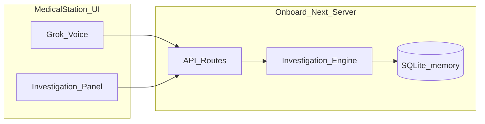

# MED-1 step-by-step implementation plan

## Stack and architecture (locked for hackathon)

| Layer                 | Choice                                                                                                                                                                   |
| --------------------- | ------------------------------------------------------------------------------------------------------------------------------------------------------------------------ |
| UI                    | Next.js 16 App Router in [ui/src/app/](ui/src/app/) + Tailwind (already present)                                                                                         |
| Onboard “computer”    | Server-only modules + Route Handlers under `ui/src/app/api/`                                                                                                             |
| Persistence           | **SQLite in-memory** via `better-sqlite3` (singleton in dev so HMR does not wipe state unexpectedly—or explicit `globalThis` cache); schema + seed in `ui/src/lib/db/`   |
| AI (judging)          | **Grok Voice API** as primary demo surface; typed chat as fallback when mic/API fails                                                                                    |
| NASA / space evidence | **Curated JSON cache** shipped with the repo (5–15 snippets tagged by topic: headache, CO2, radiation, cardiovascular adaptation)—not live OSDR scraping during the demo |



**Product guardrails baked into code from step 3 onward:** every user-facing string and LLM system prompt enforces _investigation not diagnosis_; evidence items carry `kind`: `observation` | `personal_deviation` | `correlation` | `historical_context`.

---

## Step 1 — Mission shell + in-memory data plane

**Build**

- Add DB bootstrap: `ui/src/lib/db/schema.sql`, `ui/src/lib/db/client.ts`, `ui/src/lib/db/seed.ts`.
- Tables (minimal): `crew`, `baseline_metrics`, `measurements`, `environment_readings`, `historical_evidence`, `mission_state`.
- Seed **Mars transit, day ~180**, 4 crew (`A01`–`A04`), A02 baseline HR ~62, mission env with **one latent anomaly** (e.g. elevated cabin CO2 or O2 fraction drift) not obvious until queried.
- Route Handlers: `GET /api/mission`, `GET /api/crew/[id]`, `GET /api/environment`.
- Replace boilerplate [ui/src/app/page.tsx](ui/src/app/page.tsx) with a link into `/station` (or redirect).

**You can test**

- `pnpm dev` → open `/api/crew/A02` → JSON shows personal baselines vs population reference.
- `/api/mission` shows crew roster, simulated **Earth comm delay** (e.g. 12–22 min one-way), mission day.

**Visible difference:** the app is no longer a T3 placeholder; it exposes real mission data from “onboard storage.”

---

## Step 2 — Medical station UI (spacecraft, not dashboard)

**Build**

- Route: `ui/src/app/station/page.tsx` — full-viewport “MED-1” console: dark industrial UI, crew identify (tap badge or dropdown), mission clock, comm delay badge, crew vitals summary (from baselines + last known measurements).
- Components under `ui/src/components/station/` (header, crew card, env strip).
- Optional: `POST /api/demo/reset` to re-seed DB for repeatable demos.

**You can test**

- Select **A02** → see “normal for A02” HR band vs population range.
- Env strip shows nominal vs **one amber** reading (seeded anomaly) without explaining causation.

**Visible difference:** feels like a ship system; judges can orient in 10 seconds.

---

## Step 3 — Investigation engine v1 (deterministic loop)

**Build**

- Core types + state machine in `ui/src/lib/investigation/`:
    - `Investigation` with `scope: individual | crew`, `status`, `evidence[]`, `open_questions[]`, `completed_actions[]`.
    - Loop implementation: **observe → compare → missing evidence → collect → reevaluate** driven by rules, not Grok.
- Tables: `investigations`, `investigation_evidence`, `investigation_events`.
- APIs:
    - `POST /api/investigations` — body: `{ crewId, reportedSymptoms: string[] }`
    - `POST /api/investigations/[id]/actions` — e.g. `record_measurement`, `answer_question`, `check_environment`
    - `GET /api/investigations/[id]`
- Station UI: **conversation transcript panel** (typed for now) + **“Recommended next step”** card + action buttons (“Take heart rate”, “Record SpO2”, “Review cabin environment”).

**Rule examples (demo-critical)**

- On create: add symptom observations; set open question “Need current heart rate.”
- After HR submitted: run baseline compare (Step 4 logic can live here early); if deviated, add `personal_deviation` evidence; if SpO2/temp missing, ask for them.
- After vitals complete: auto-action `check_environment` pulls env readings into evidence.

**You can test**

- As A02, type symptoms “dizzy, headache” → investigation created.
- Follow prompts → enter HR **84** → investigation shows deviation + asks for SpO2/temp.
- Complete flow → env anomaly appears as **correlation**, wording like “occurred during unusual cabin reading,” never “caused by.”

**Visible difference:** the product is the **investigation loop**, not charts.

---

## Step 4 — Personal baseline & mission-phase awareness

**Build**

- `ui/src/lib/baseline/compare.ts`: for each metric, compute status:
    - `within_personal_baseline`
    - `elevated_vs_personal_baseline` / `depressed_vs_personal_baseline`
    - optional `drifting_over_mission` (simple: compare last 7 seeded points vs first 7 for demo narrative)
- Surface in UI: side panel **“Normal for A02”** vs **“Right now”** with plain-language deviation labels (no diagnosis).
- Optional proactive hook: `GET /api/crew/[id]/trends` flags multi-metric drift; station can show a quiet “routine check suggested” before symptoms (nice-to-have if time; keep thin).

**You can test**

- HR 72 for A02 → no deviation; HR 84 → flagged “significant vs A02 baseline (~62).”
- Copy audit: no sentence contains “diagnose”, “you have”, “caused by”.

**Visible difference:** judges see **personal baseline** as the core insight.

---

## Step 5 — Spacecraft + space-environment + NASA historical evidence layers

**Build**

- Extend `check_environment` to attach structured evidence: spacecraft readings + **cached space weather / radiation summary** for mission day (static JSON in `ui/src/data/space-environment.json`).
- `historical_evidence` table already seeded; retrieval in `ui/src/lib/evidence/retrieve.ts` by **tags** (symptom + physiological category + env anomaly type)—keyword/tag match is enough for hackathon.
- UI: **Evidence board** grouped into Astronaut | Spacecraft | Space environment | Historical context, each card labeled with evidence `kind`.

**You can test**

- Complete A02 individual investigation → board shows 4 layers.
- Historical cards say “Previous spaceflight research documented…” not “this astronaut has X.”

**Visible difference:** satisfies **Make it Legendary** (real space context) without overclaiming causality.

---

## Step 6 — Crew-wide escalation (demo climax)

**Build**

- `ui/src/lib/investigation/crew-escalation.ts`:
    - Within rolling window (e.g. 48h mission time), if **≥2 crew** report overlapping symptoms (headache), merge or link investigations under a `crew_investigation_id`, set `scope: crew`, bump priority on env evidence.
- APIs: creating investigation for A03 with headache auto-updates A02’s open investigation.
- UI state change: banner **“POSSIBLE SHARED CREW EVENT — 2/4 crew”**, reprioritized env section, individual narratives preserved underneath.

**You can test**

- Run A02 flow partially or fully → switch to **A03**, report “headache too” → banner + linked evidence counts **2/4**.
- Confirm individual deviations (A02 HR) still visible; env anomaly surfaced as **shared lead**.

**Visible difference:** the “MED-1 reasons across the crew” moment works live.

---

## Step 7 — Grok Voice at the medical station

**Build**

- Env: `XAI_API_KEY` in `.env` (document in [ui/.env.example](ui/.env.example)).
- `ui/src/app/api/voice/session/route.ts` — server-side Grok Voice session orchestration (keep keys off client).
- Station UX:
    - **Push-to-talk** or hold-to-speak → transcript appears in investigation thread.
    - Grok used to: (1) **paraphrase back** investigation-safe language, (2) extract structured intents (`report_symptoms`, `confirm_action`, `read_measurement_value`) sent to existing investigation APIs—**engine remains source of truth**.
- System prompt: explicit refusal to diagnose; must call structured “next step” aligned with engine recommendations.
- Fallback: if Voice fails, typed input still works (required for judging reliability).

**You can test**

- Speak: “I’m A02, dizzy with a headache” → same investigation as Step 3 typed path.
- Speak HR value or press UI button → deviation appears with voice readout optional.

**Visible difference:** hackathon Grok requirement is **center stage** in the demo script.

---

## Step 8 — Autonomous mode, sync queue, and ground medical packet

**Build**

- `mission_state.link_status`: `connected | autonomous` (toggle in station header for demo).
- When autonomous:
    - Banner: **EARTH LINK LOST — AUTONOMOUS MEDICAL MODE**
    - Voice/text and investigation loop **continue**; Grok calls skipped or queued locally.
    - `sync_queue` table stores events with payload.
- On reconnect: `POST /api/sync/push` marks queue flushed; optional “deep analysis” stub message.
- `GET /api/investigations/[id]/handoff` returns **Ground Medical Event Package** JSON (and printable Markdown view at `/station/handoff/[id]`):
    - crew involved, symptoms, personal deviations, measurements, crew signal, env + space + historical sections, completed actions, open questions.
- Polish for judging: 3-minute **scripted demo path** page or `?demo=1` checklist; reset endpoint.

**You can test**

- Toggle link off mid-investigation → finish measurements → queue grows.
- Toggle on → handoff packet complete enough that a clinician could orient in 30 seconds.
- Full run: A02 voice → HR deviation → env → A03 headache → crew escalation → handoff export.

**Visible difference:** autonomous spacecraft system first, Earth augmentation second—matches your spec’s closing beat.

---

## Suggested folder map (after all steps)

```
ui/src/
  app/
    station/page.tsx
    station/handoff/[id]/page.tsx
    api/mission/...
    api/investigations/...
    api/voice/session/...
    api/sync/...
  lib/
    db/
    investigation/
    baseline/
    evidence/
  data/
    historical-evidence.json
    space-environment.json
  components/station/
```

---

## Demo script alignment (what to rehearse)

1. Identify **A02** → voice report dizziness + headache.
2. MED-1 requests HR → **84** → personal deviation; other vitals normal.
3. Environment check → abnormal cabin reading + historical context cards.
4. **A03** reports headache → **2/4 crew** escalation.
5. Toggle **autonomous** briefly → continue checklist → restore link → open **handoff packet**.

---

## Scope control (if time runs short)

| Cut last                   | Keep                              |
| -------------------------- | --------------------------------- |
| Mission-phase drift trends | Steps 1–6 + minimal Voice in 7    |
| Space weather JSON layer   | Spacecraft env + historical cache |
| Fancy visuals              | Evidence board + crew escalation  |

---

## Dependencies to add (when implementing)

- `better-sqlite3` + `@types/better-sqlite3`
- Grok/xAI SDK or fetch to Voice endpoints (per current xAI docs)
- Optional: `shadcn/ui` for fast station components ([shadcn skill](C:\Users\nanna.agents\skills\shadcn\SKILL.md) when you reach Step 2)

No separate backend service; all logic stays in the Next.js server boundary you chose.
