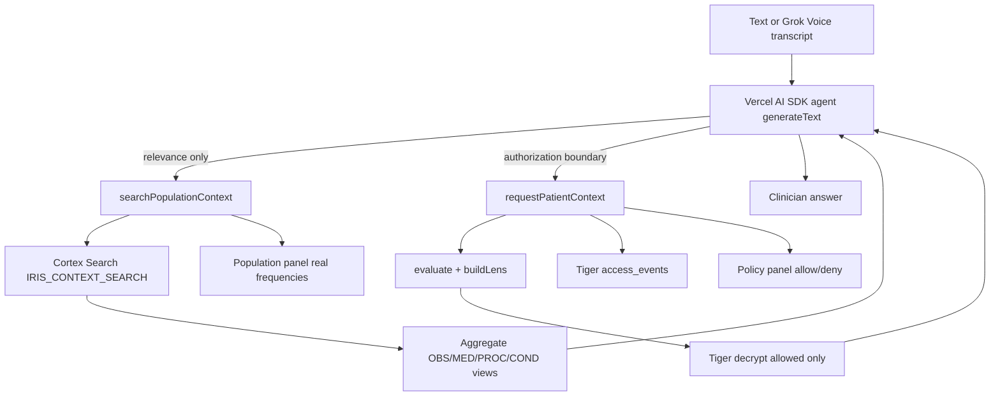

# Snowflake Clinical Context → Iris Integration

## Current state (what we reuse)

| Layer                                    | Status                                 | Where                                                                                                                                  |
| ---------------------------------------- | -------------------------------------- | -------------------------------------------------------------------------------------------------------------------------------------- |
| Snowflake corpus + `IRIS_CONTEXT_SEARCH` | Done outside the app                   | Do not recreate                                                                                                                        |
| Tiger patient store, crypto, audit       | Done                                   | [`ui/src/server/store`](ui/src/server/store), [`context.ts`](ui/src/server/iris/context.ts), [`audit.ts`](ui/src/server/iris/audit.ts) |
| Deterministic policy                     | Done                                   | [`engine.ts`](ui/src/server/iris/engine.ts), [`policy-rules.ts`](ui/src/server/iris/policy-rules.ts)                                   |
| Grok text/STT/TTS                        | Custom `fetch` to xAI                  | [`client.ts`](ui/src/server/grok/client.ts) — **no** `ai` / `@ai-sdk/xai` yet                                                          |
| “Tool” dispatch                          | Manual `if/else` after `extractIntent` | [`/api/voice/interpret`](ui/src/app/api/voice/interpret/route.ts)                                                                      |
| Doctor chart + Ask Iris                  | Live demo surface                      | [`/doctor/patients/[id]`](ui/src/app/doctor/patients/[id]/page.tsx)                                                                    |
| Voice                                    | Same interpret route after STT         | [`use-voice.ts`](ui/src/hooks/use-voice.ts)                                                                                            |

**Gap:** No Snowflake client, no population tool, `requestedContext` from intent is parsed then ignored, and the UI does not show a relevance → policy pipeline.

## Locked architecture

Hard rules enforced in code:

- Snowflake never authorizes.
- Patient ciphertext only via existing `buildLens` → `allowedIds`.
- No arbitrary SQL from the model.
- Population copy always says “synthetic clinical contexts,” never real-doctor evidence.

## Approach decision

**Hybrid agent migration** (not a full rewrite of voice media):

- Add `ai` + `@ai-sdk/xai` for the clinical agent/tool loop.
- Keep existing [`grokChat` / STT / TTS](ui/src/server/grok/client.ts) for transcription, speech, and non-agent helpers.
- Replace the default `request_context` branch in interpret with `generateText` + tools; keep break-glass / handoff / delegation / history as tools that call existing server functions (thin adapters — no parallel policy).

## Implementation sequence

### 1. Snowflake server client + env

Add server-only module [`ui/src/server/snowflake/client.ts`](ui/src/server/snowflake/client.ts) (path aligned with existing `server/` layout, not a new top-level `lib/`).

Env (extend [`ui/.env.example`](ui/.env.example); never client-exposed):

- `SNOWFLAKE_ACCOUNT`, `SNOWFLAKE_USERNAME`, `SNOWFLAKE_PAT` (programmatic access token); optional `SNOWFLAKE_ROLE`
- `SNOWFLAKE_WAREHOUSE=IRIS_WH`, `SNOWFLAKE_DATABASE=IRIS`, `SNOWFLAKE_SCHEMA=SYNTHEA`
- `SNOWFLAKE_CORTEX_SEARCH_SERVICE=IRIS_CONTEXT_SEARCH`
- Optional: `SNOWFLAKE_ACCOUNT_URL` for Cortex REST

**Retrieval (Phase A):** Call Cortex Search via the **application REST API** (`…/cortex-search-services/IRIS_CONTEXT_SEARCH:query`) with `query`, `columns` (`encounter_id`, plus concept columns if needed), `limit: 100`. Avoid `SEARCH_PREVIEW` as the primary app path (Snowflake marks it for worksheet testing / higher latency).

**Aggregation (Phase B):** `snowflake-sdk` connection pool / singleton for parameterized SQL against normalized views (`OBSERVATIONS`, `MEDICATIONS`, `PROCEDURES`, `CONDITIONS`) filtered by retrieved `encounter_id`s.

Graceful degrade: if Snowflake env missing, tool returns a clear `unavailable` payload so the agent can still call `requestPatientContext` (demo does not hard-crash).

### 2. Population context service

[`ui/src/server/iris/population-context.ts`](ui/src/server/iris/population-context.ts):

1. `searchCortex(clinicalSituation) → encounter_id[]` (cap ~100).
2. Aggregate per concept: `COUNT(DISTINCT encounter_id)`, `frequency = count / matchedContexts`.
3. Top 10–20 per category; return compact JSON matching the handoff shape (`query`, `corpus` constants, `matchedContexts`, `observations|medications|procedures|conditions`).
4. Map population concept names → Iris `FragmentType` hints only as **suggestions for the model** (e.g. blood pressure → `vitals`), never as allow scores.

Unit-test aggregation math with fixture encounter sets (no live Snowflake required in CI).

### 3. Vercel AI SDK tools

New folder [`ui/src/server/ai/tools/`](ui/src/server/ai/tools/):

| Tool                                    | Execute                                                               | Must not                            |
| --------------------------------------- | --------------------------------------------------------------------- | ----------------------------------- |
| `searchPopulationContext`               | Call population-context service                                       | Touch Tiger / policy                |
| `requestPatientContext`                 | Session update + `buildLens` + `modelContext`                         | Use Snowflake scores as permissions |
| `requestBreakGlass`                     | Return client-driven challenge flag (existing flow)                   | Grant data inside the model turn    |
| Existing handoff / delegation / history | Thin wrap of [`actions.ts`](ui/src/server/iris/actions.ts) / timeline | Reimplement policy                  |

**`searchPopulationContext` description** (semantics matter): population-scale **synthetic** FHIR corpus; contextual evidence only; not authorization, guidelines, or real physician behavior.

**`requestPatientContext` inputs:** `{ purpose, task?, requestedContext: FragmentType[] }` plus closure-bound `sessionId` / `patientId`.

### 4. Wire `requestedContext` into policy (small, necessary change)

Today `evaluate()` ignores requested fields; intent already collects them.

Extend [`EvaluateInput`](ui/src/server/iris/engine.ts) with optional `requestedTypes?: FragmentType[]`:

- If provided: decrypt/release only `policyAllow ∩ requestedTypes`.
- Requested but policy-denied → explicit deny reasons (demo: psychiatric notes ✕).
- Not requested → omitted from this tool response (do not treat as policy deny).
- Empty/missing requested list → current purpose-wide lens (purpose toggle / `/api/context` unchanged).

Extend [`buildLens`](ui/src/server/iris/context.ts) options accordingly. Add engine tests for treatment + hypertension request vs psychiatric_note denial.

### 5. Agent route

Refactor [`/api/voice/interpret`](ui/src/app/api/voice/interpret/route.ts) (keep path so doctor UI / voice need minimal churn):

1. Bind tools with session/patient context.
2. `generateText` via `@ai-sdk/xai` (`GROK_API_KEY`, model from `GROK_MODEL`).
3. System prompt: understand purpose → call population tool when clinical situation benefits → then `requestPatientContext` → answer only from authorized payload; accept denials; never invent PHI; synthetic-corpus wording.
4. Collect tool results into a structured `pipeline` object for the UI:
    - intent/purpose/clinicalSituation
    - population result (real frequencies)
    - policy decisions (requested ✓/✕)
    - lens + natural-language answer
5. Preserve keyword/offline fallback if Grok/SDK unavailable (existing `keywordIntent` + direct `buildLens`, optional skip population).

Voice stays an input modality: STT → same interpret agent. No separate voice policy system. Full Grok Voice duplex agent is **out of scope** for this pass.

### 6. Demo UI visibility

On [`doctor/patients/[id]/page.tsx`](ui/src/app/doctor/patients/[id]/page.tsx), during Ask Iris:

- New [`population-context-panel.tsx`](ui/src/components/iris/population-context-panel.tsx): corpus stats, matched count, concept % from **actual tool output** (never fabricated).
- New [`policy-decision-panel.tsx`](ui/src/components/iris/policy-decision-panel.tsx): requested categories with allow/deny from lens/pipeline.
- Steps copy: Understanding intent → Searching Snowflake → Applying Iris policy → Answer.

Patient page ([`/patient`](ui/src/app/patient/page.tsx)) already reads Tiger audit — no Snowflake there; ensure `buildLens` audit metadata remains the source of truth for “what was viewed.”

### 7. Verification (manual demo script)

1. Doctor opens Maya (`P1048`): “I'm evaluating Maya for persistent high blood pressure.” → population tool fires → real frequencies → `requestPatientContext` → vitals/meds/labs allowed → answer + audit.
2. Request psychiatric notes under treatment → policy ✕, no plaintext to model.
3. Break glass path unchanged (hardware confirm + reason + flagged audit); population not involved in elevation.

## Explicit non-goals

- Recreate Synthea load, views, or Cortex Search service
- Second vector DB / fine-tuning
- Claiming HIPAA compliance
- Building voice as a separate authorization stack
- Rewriting Tiger schema, firmware, or patient transparency model

## Key files to touch

- Add: `ui/src/server/snowflake/client.ts`, `ui/src/server/iris/population-context.ts`, `ui/src/server/ai/agent.ts`, `ui/src/server/ai/tools/*.ts`, UI panels under `ui/src/components/iris/`
- Change: `ui/package.json` (deps), `.env.example`, `engine.ts` / `context.ts` / tests, `interpret/route.ts`, doctor chart page
- Leave alone: Snowflake DDL/ingestion, firmware, patient audit presentation model
