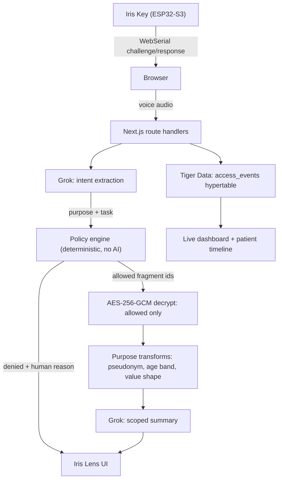

# Iris

**A purpose-bound patient-context system.**

Most hospital systems ask: _can this employee open the chart?_
Iris also asks: _why are they opening it right now, and what do they actually need for that task?_

Hardware-backed authentication verifies a registered credential. Role, relationship
and stated purpose decide what context is released. Sensitive data stays encrypted
per field, so only the fields a purpose authorizes are ever decrypted. Emergency
access is always available and always recorded. Patients can see who opened their
record and why, in plain English.

---

## The one rule

```
voice request
  -> Grok extracts intent (purpose, task, requested context)
  -> deterministic policy engine decides
  -> decrypt ONLY the authorized fragments
  -> send only those to the model
  -> scoped answer + audit event
```

Policy authorizes. The model interprets, summarizes and presents. The model never
widens an allow list — a mis-classified intent produces the wrong correctly-scoped
view, never a broader one.

`decryptFragment()` takes the current decision's allow set as an argument and
throws if asked for anything else. The Grok client refuses to send a payload if any
restricted fragment carries plaintext. Both are in the code so a security judge can
read them: [`crypto.ts`](ui/src/server/iris/crypto.ts),
[`generate.ts`](ui/src/server/grok/generate.ts).

## Architecture



## What each piece does

| Piece                           | Role                                                                                     |
| ------------------------------- | ---------------------------------------------------------------------------------------- |
| **ESP32-S3 Iris Key**           | Authentication, continued presence, physical confirmation of emergency access              |
| **Policy engine**               | Pure function. Same inputs, same allow/deny set, every time                                |
| **Per-fragment AES-256-GCM**    | One encrypted row per clinical fact, so a purpose can open three fields and not the chart |
| **Grok**                        | Intent extraction, scoped summaries, handoff drafting, dictation to structured fields      |
| **Tiger Data**                  | `access_events` hypertable, continuous aggregate, hash-chained audit trail                 |

## The purpose-bound idea, concretely

Same doctor. Same patient. Only the purpose changes:

| Purpose                 | Authorized                                                             | Withheld                                           |
| ----------------------- | ---------------------------------------------------------------------- | -------------------------------------------------- |
| Treatment               | 12 fields: vitals, allergies, medications, cardiac history, labs, notes | behavioural health note, billing, address, insurance |
| Prescribing             | 6 fields: allergies, medications, diagnoses, labs, cardiac history      | vitals, notes, identifiers beyond name              |
| Research                | 7 fields, with the name replaced by a study code and the birth date reduced to a 5-year age band | contact details, clinical notes, billing |
| Emergency (break-glass) | 15 fields including the behavioural health note                        | billing — an emergency is clinical, not financial   |
| Scheduling (reception)  | 6 fields: name, DOB, phone, address, insurance, appointment            | all clinical content                                |
| Engineering debug       | 3 fields, medications reduced to `string(18) "W•••••••••"`              | identity, contact details, everything else          |

Withheld fields are never silently dropped. The chart says how many were withheld
for the current purpose, and opening that line lists each one with the reason the
engine gave — so the clinician can see what the purpose cost them, and ask for a
different one.

## Break-glass

1. The clinician asks for emergency access, by voice or button.
2. They press the physical button on the Iris Key (or the demo path confirms server-side).
3. A 15-minute expanded window opens immediately. The event is flagged for review.
4. They record a reason afterward. It is stored for the patient and compliance; it is not evaluated to grant or deny access.

Access is never refused. If the same clinician overrides repeatedly across
departments, the dashboard raises it for compliance review — frequency changes
review priority, never availability.

## Running it

```bash
cd ui
pnpm install
cp .env.example .env     # optional: works with no configuration at all
pnpm dev
```

Open <http://localhost:3000>. Plug in a board and click **Connect** (Chrome or
Edge, for WebSerial), or use one of the two demo keys, which run the same
challenge-response path against a simulated device:

| Demo key                 | Signs in as    | Lands on   |
| ------------------------ | -------------- | ---------- |
| Doctor - Dr. Maya Chen   | `IRIS-0042`    | `/doctor`  |
| Patient - Maya Patel     | `IRIS-PATIENT-1048` | `/patient` |

A second patient card, `IRIS-PATIENT-2210` (Daniel Osei), is seeded but not on
the login screen; it is there for showing a live break-glass land in the
timeline of the patient it was used on.

There are four screens: `/login`, `/doctor` (the doctor's own patients, plus
lookup for everyone else), `/doctor/patients/[id]` (the chart), and `/patient`
(who opened my record). The compliance dashboard at `/security` is reachable by
URL and is deliberately not in the navigation — it is the auditor's view, not the
clinician's.

### Doctor and patient are separate accounts

The credential decides the surface, and there is no overlap. A doctor's session
on `/patient` and a patient's session on `/doctor` both get a "this is not your
view" panel, and the APIs behind them return `403` rather than relying on the UI
to hide anything. `GET /api/patient/me/history` takes no patient id at all — the
record is chosen by the credential, so there is no parameter to tamper with.

The policy engine enforces the same thing independently: no rule in
[policy-rules.ts](ui/src/server/iris/policy-rules.ts) grants the `patient` role
anything, so a patient session that calls `/api/context` directly gets all
twenty fragments denied and zero plaintext.

With no `DATABASE_URL`, Iris runs against an in-memory store with the same
interface, seeded identically. To use Tiger Data:

```bash
DATABASE_URL="postgres://..." pnpm db:seed   # applies the schema, loads 4,805 synthetic events
```

With no `GROK_API_KEY`, intent extraction falls back to a deterministic classifier
and summaries to templates. The whole demo still runs; it just stops being clever.

### Checks

```bash
pnpm test                          # policy engine, crypto boundary, audit chain
pnpm check                         # lint + typecheck + tests
node scripts/smoke.mjs http://localhost:3000   # walks all six demo scenes
pnpm device:secrets                # provisioning values for the boards
```

## Hardware

Two ESP32-S3 boards, same firmware, different identities: `IRIS-0042` (Dr. Maya
Chen) and `IRIS-ENGINEER-07` (Alex Kim). Newline-delimited JSON over USB CDC;
HMAC-SHA256 over server-issued nonces; BOOT button for confirmation; a WS2812
strip mirroring the session state in the same colours as the UI. Wiring, protocol
and provisioning are in [`firmware/README.md`](firmware/README.md).

Nonces always come from the server. The browser is a serial pipe and holds no
secret.

## What we are claiming, and what we are not

This is a hackathon prototype built in 24 hours on synthetic data. The wording
below is deliberate.

| We say                                                        | We do not say                                                     |
| ------------------------------------------------------------- | ----------------------------------------------------------------- |
| Hardware-backed credential                                    | This device proves biologically that this person is Dr. Chen       |
| Purpose-aware privacy and governance layer                     | HIPAA legally requires exactly this access model                   |
| Tamper-evident audit trail                                     | Mathematically immutable database                                 |
| Emergency access is logged and investigated                    | AI determines whether a doctor really deserves emergency access    |
| Production deployment would require appropriate BAA/HIPAA infrastructure | Grok makes this HIPAA compliant                        |

Specifically:

- **Synthetic data only.** No real patient information appears anywhere.
- **The audit trail is tamper-evident, not immutable.** Altering one event breaks
  every later hash, which makes tampering detectable. An operator with write access
  could still rebuild the chain.
- **Key management is a prototype.** One symmetric key from the environment. A real
  deployment would hold it in a KMS/HSM outside the database, so that possession of
  a backup is not possession of the plaintext.
- **The device secret lives in NVS**, not in eFuse. Burning eFuses is irreversible
  and we were not going to risk the demo on it.
- **A credential is not a person.** The Iris Key proves a registered device tied to
  a user is present. It does not prove who is holding it.
- **Simulated keys exist** so the demo survives a dead board, and every event they
  produce is tagged `simulated`.

## Layout

```
ui/src/server/iris/     policy engine, crypto, audit chain, context service, actions
ui/src/server/store/    Tiger adapter + in-memory adapter behind one interface
ui/src/server/grok/     intent extraction, scoped generation, voice transport
ui/src/server/db/       SQL migration: hypertable, continuous aggregate
ui/src/app/             login / doctor / doctor/patients/[id] / patient, plus route handlers
ui/src/app/security/    compliance dashboard, reachable by URL, not in the navigation
ui/src/lib/iris-key.ts  WebSerial transport
firmware/iris-key/      ESP32-S3 sketch
docs/                   demo script, agent-driven work log
```

## Contributors

Navin Narayanan, Akshat Goyal, Adit Swamy, and Sakthi Sadayappan. See
[CONTRIBUTORS.md](CONTRIBUTORS.md).
